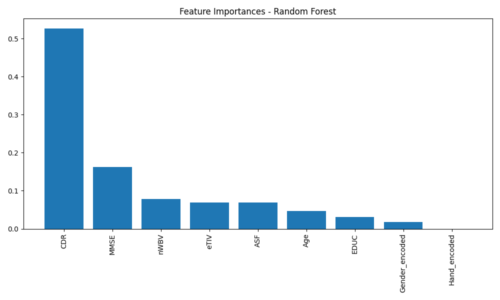
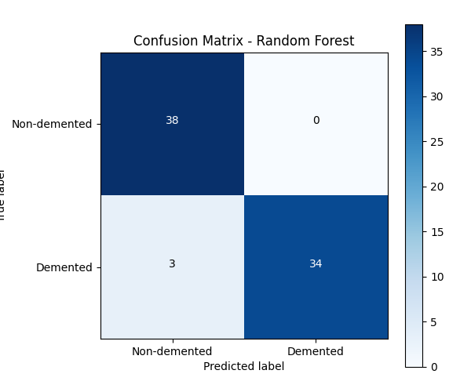
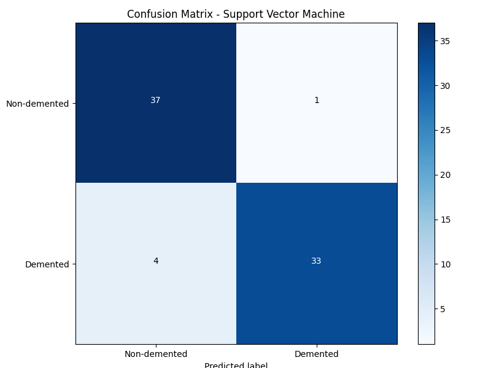

# Dementia Status Prediction

A machine learning project to predict dementia status using the Open Access Series of Imaging Studies (OASIS) dataset from Kaggle.

## Overview

This project analyzes MRI data from the OASIS dataset (sourced from Kaggle) to predict dementia status (demented vs. non-demented) using various machine learning techniques. The analysis includes data preprocessing, feature selection, model training, and performance evaluation.



## Dataset

The dataset, downloaded from Kaggle, includes MRI scans and clinical data from 150 subjects aged 60 to 96. Each subject may have multiple visits, with the following key features:

- Demographics (age, gender, education, socioeconomic status)
- Clinical assessment scores (MMSE, CDR)
- MRI-derived measurements (eTIV, nWBV, ASF)
- Longitudinal data (multiple visits for some subjects)

You can find the original dataset here: [OASIS Brain MRI Dataset on Kaggle](https://www.kaggle.com/datasets/jboysen/mri-and-alzheimers)

## Requirements

- Python 3.8+
- pandas
- numpy
- scikit-learn
- matplotlib
- seaborn (for advanced visualizations)
- xgboost (optional, for XGBoost model)

You can install the required packages using:

```bash
pip install pandas numpy scikit-learn matplotlib seaborn xgboost
```

## Usage

### Quick Start

Run the simplified version for a quick analysis:

```bash
python simple_dementia_prediction.py
```

This script performs essential preprocessing and trains logistic regression and random forest models with default parameters.


For a Support Vector Machine model with hyperparameter tuning:

```bash
python svm_dementia_model.py
```

This script implements an SVM classifier optimized for high precision and accuracy.

### Comprehensive Analysis

For a more thorough analysis with additional models and hyperparameter tuning:

```bash
python dementia_prediction.py
```

This script includes:
- Extended data exploration
- Hyperparameter optimization with GridSearchCV
- Additional models (XGBoost)
- More detailed visualizations and performance metrics

## Results

All models achieved strong performance, with the SVM model showing excellent balance between precision and recall:

| Model | Accuracy | Precision | Recall | F1 Score | ROC-AUC |
|-------|----------|-----------|--------|----------|---------|
| Random Forest | 0.96 | 1.00 | 0.92 | 0.96 | 0.96 |
| SVM | 0.93 | 0.97 | 0.89 | 0.93 | 0.95 |
| Logistic Regression | 0.96 | 1.00 | 0.92 | 0.96 | 0.94 |

The Random Forest model demonstrated the best overall performance, but the SVM provides an alternative approach with different trade-offs in precision vs. recall. This gives practitioners options depending on their specific needs.

### Key Findings

1. **Feature Importance**: The Clinical Dementia Rating (CDR), Mini-Mental State Examination (MMSE), and Age were the most predictive features.
2. **High Precision**: Both Random Forest and Logistic Regression achieved 100% precision, with SVM close behind at 97%. This means very few false positives.
3. **Good Recall**: With recall ranging from 89-92%, the models identified most dementia cases.
4. **Model Diversity**: Having multiple models with different characteristics allows for more robust predictions and gives options based on whether precision or recall is more important in specific clinical contexts.
5. **Hyperparameter Optimization**: The SVM model benefited from extensive hyperparameter tuning (optimal parameters: C=10, gamma='scale', kernel='rbf', class_weight='balanced').

## Visualizations

The scripts generate multiple visualizations to aid in understanding the data and model performance:

- Distribution of dementia status
- Feature distributions by group
- Correlation matrix
- Confusion matrices
- ROC curves
- Feature importance plots

Example confusion matrices:




## Future Improvements

- Incorporate more sophisticated feature engineering
- Explore deep learning approaches for image analysis
- Implement more advanced handling of longitudinal data
- Validate models on external datasets
- Develop a web interface for easy use by clinicians
- Ensemble methods combining SVM, Random Forest, and other models

## License

This project is available under the MIT License - see the LICENSE file for details.

## Acknowledgments

- Data provided by Kaggle and the Open Access Series of Imaging Studies (OASIS)
- Inspired by research on early dementia detection
- Thanks to the scikit-learn and Python communities for their excellent tools
- Thanks to the Kaggle community for making this dataset accessible

## Contact

Feel free to contact me with any questions or suggestions for improvement.

---

**Note**: This project is for research purposes only and should not be used for clinical diagnosis without proper validation. 